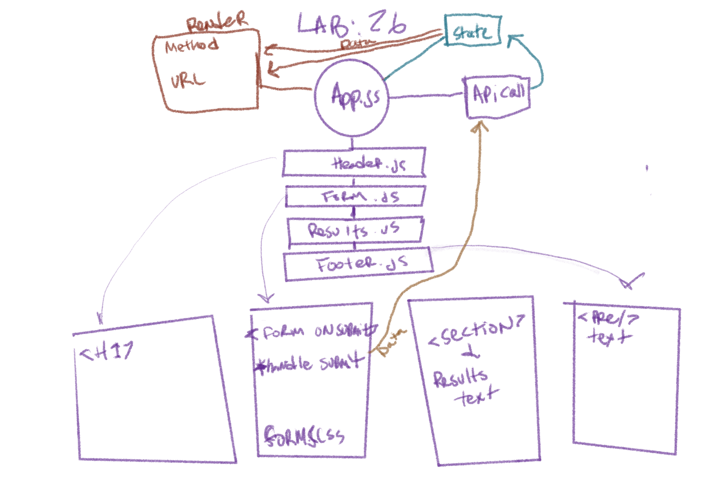
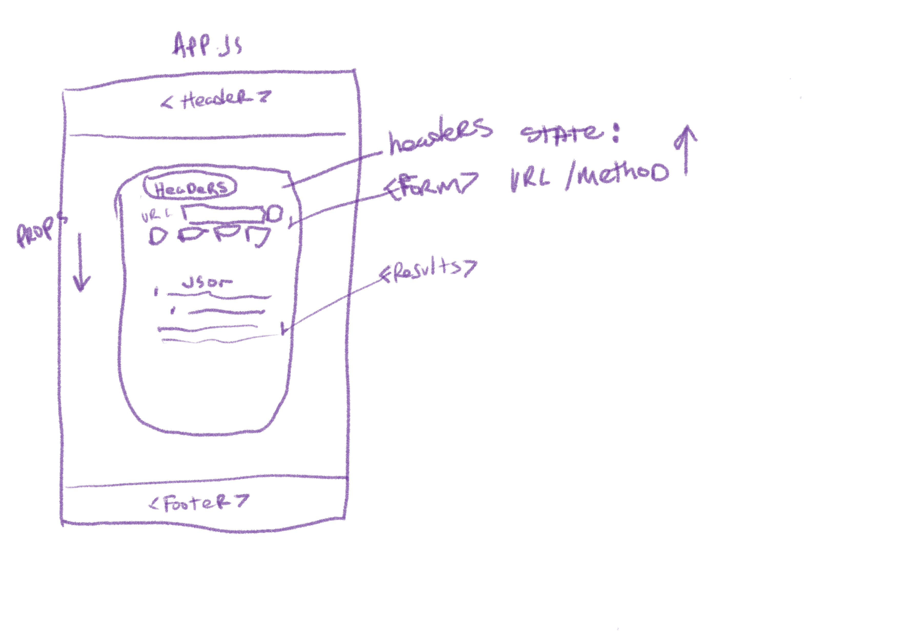

# resty
# Lab - Class 26

## Author: Tek Jones
  * [test report]()
  * [deployment sandbox lab 26](https://codesandbox.io/s/pensive-platform-lmcz9)
  * [deployment sandbox lab 27](https://codesandbox.io/s/exciting-bardeen-h2hhp)

## About
- The application will be an API testing tool that can be run in any browser, allowing a user to easily interact with APIs in a familiar interface.

## Setup

## Running the app
  * npm start

## Test
* npm test

### Phase 1
- Today, we begin the first of a 4-Phase build of the RESTy application, written in React. In this first phase, our goal is to setup the basic scaffolding of the application, with intent being to add more functionality to the system as we go. This initial build sets up the file structure so that we can progressively build this application in a scalable manner

### Technical Requirements
- The application, as written by our development team was done using class components as a proof of concept. In order to go to production, we’re going to have to convert this to an application written using React function components so that our foundation is both stable and high performing.

## UML

___

### Phase 2
- we will be receiving user input in preparation of connecting to live APIs, using the useState() hook in our functional components.

### User Stories
- As a user, I want to enter the REST Method and URL to an API
- As a user, I want to see a summary of my request as well as results returned from an API request in my browser in a readable format

## UML

### Phase 3
-  we will be connecting RESTy to live APIs, fetching and displaying remote data. Our primary focus will be to service GET requests

### User Stories
- As a user, I want to enter the URL to an API and issue a GET request so that I can retrieve it’s data
- As a user, I want to see the results returned from an API request in my browser in a readable format

## UML
