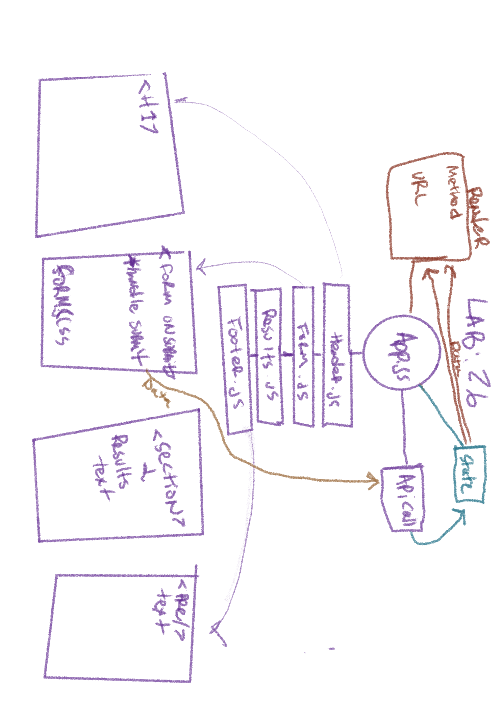

# resty
# Lab - Class 26

## Author: Tek Jones
  * [test report]()
  * [deployment]()

## About
- The application will be an API testing tool that can be run in any browser, allowing a user to easily interact with APIs in a familiar interface.

## Setup

## Running the app
  * npm start

## UML

### Phase 1
- Today, we begin the first of a 4-Phase build of the RESTy application, written in React. In this first phase, our goal is to setup the basic scaffolding of the application, with intent being to add more functionality to the system as we go. This initial build sets up the file structure so that we can progressively build this application in a scalable manner

### Technical Requirements
- The application, as written by our development team was done using class components as a proof of concept. In order to go to production, we’re going to have to convert this to an application written using React function components so that our foundation is both stable and high performing.

